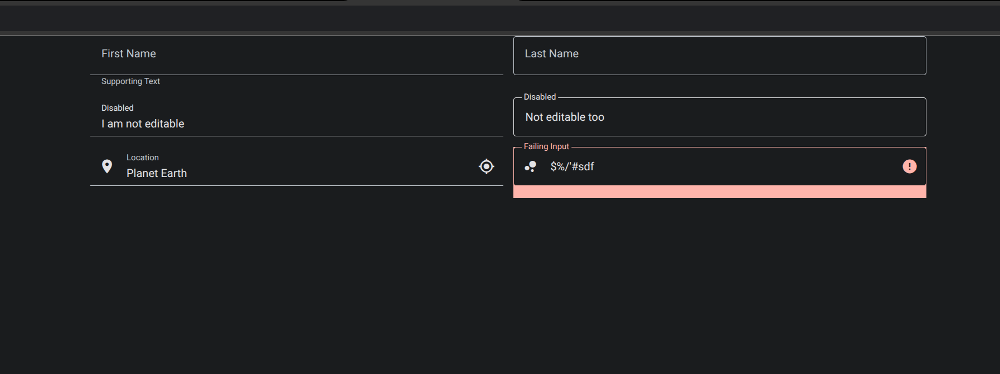

# Angular Materialize

You’ve created a new Angular application, connected a popular CSS framework, but instead of the expected wow effect, you’ve encountered issues: styles don’t look the way you intended, form validation behaves oddly, and some elements don’t respond to state changes at all. Sounds familiar? This is a common scenario when CSS frameworks are integrated without considering Angular’s specifics.

This article will help you understand why these challenges arise and demonstrate how to properly integrate CSS frameworks into Angular. We’ll explore key issues, provide solutions, and implement a sleek, reactive input field using Angular’s best practices.

[Read more on habr](https://habr.com/ru/article/870192/)

## Demo 



## Development server

To start a local development server, run:

```bash
yarn ng serve
```

Once the server is running, open your browser and navigate to `http://localhost:4200/`. The application will automatically reload whenever you modify any of the source files.

## Building

To build the project run:

```bash
ng build
```

This will compile your project and store the build artifacts in the `dist/` directory. By default, the production build optimizes your application for performance and speed.
